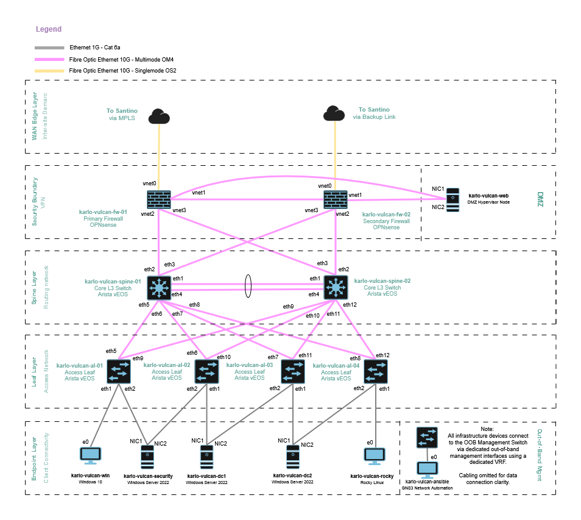

# North Star Lab

## Table of Contents

1.0 [Executive Summary](#10-executive-summary)  

- 1.1 Purpose  
- 1.2 Scope  
- 1.3 Target Audience  
- 1.4 References  

2.0 [Project Goals aligned with Business Justification](#20-project-goals-aligned-with-business-justification)  

- 2.1 Capacity Planning and Corporate Requirements
- 2.2 Infrastructure as Code  
- 2.3 NIST Cybersecurity Compliance  

3.0 [Corporate Site Profiles](#30-site-profiles)  

- 3.1 Headquarters: Vulcan  
- 3.2 Remote Branch: Santino  

4.0 [Network Design](#40-network-design)  

- 4.1 Core Fabric & Underlay Routing  
- 4.2 Security Boundary & Inter-VLAN Routing  
- 4.3 Edge Transit & WAN Routing  
- 4.4 Virtualization & Endpoint Isolation  

5.0 [High Availability & Redundancy](#50-high-availability-and-redundancy)  

- 5.1 Security Boundary  
- 5.2 Physical Redundancy  
- 5.3 Logical Redundancy  

6.0 [Management, Automation, and Monitoring](#60-management-automation-and-monitoring)  

- 6.1 Out-of-Band Management  
- 6.2 Infrastructure Automation  
- 6.3 The Three Domains of North Star monitoring  

7.0 [Disaster Recovery and Business Continuity](#70-disaster-recovery-and-business-continuity)  

- 7.1 Backup Strategy  
- 7.2 Infrastructure as a Code Restoration  
- 7.3 Site Survivability and lab scenario planning  

8.0 [Security in Depth](#80-security-in-depth)

## 1.0 Executive Summary

### 1.1 Purpose

This high-level document outlines the design decisions and business justifications for a simulated corporate enterprise network called North Star. It defines the standard enterprise documentation expected for a project that connects a central Headquarters called Vulcan, with a cost-optimized fledgling remote branch called Santino.  

The key objective of this document is to establish the standardized site profiles, and security boundaries required to deploy and manage this environment. The intent is to ensure that the detailed design documentation will serve as the As-built record, which will match the production state of both sites.

For granular configuration, IP schemas, and device-specific information, refer to the [detailed design documentation](../1_2_detailed_design/detailed_design_document.md).

### 1.2 Scope

This section governs the design and high-level traffic flows of the North Star environment.  

The following are in-scope:

- Core Routing & Switching: The Arista vEOS Leaf-Spine inter-VLAN routing, OSPF, MLAG, and LACP configuration.  

- Security & Perimeter Defense: The OPNsense Active/Passive boundary.  

- Automation: The Ansible repository structure and configuration management for Arista switches.  

- Monitoring: The centralized monitoring and SIEM strategy utilizing Splunk, Wazuh, ntopng, Prometheus, and Grafana.  

- Compute & Virtualization: The Proxmox hypervisor layer hosting critical enterprise services.

The following are out-of-scope:

- Hardware considerations based off capacity planning is excluded. Typically a requirements discovery phase would be conducted to determine the number of connections needed for the environment, this would determine the number of devices and types needed to deliver these requirements.  

- Cloud integration is excluded from this design.  

- Wireless AP connectivity is not a focus, although in corporate environments it is acknowledged that a LAN-wireless and/or guest Wi-Fi networks are highly likely to be deployed and used.

- Although an MPLS WAN network will be created to simulate the inter-site links, this is not the focus of the environment and will only include bootstrap configuration files needed to replicate this in GNS3.

- Physical housing inside racks at a corporate site is excluded from the design for simplicity.

- SANs and other storage devices are excluded. Repository for Veeam will be local storage on a VM due to the relatively small number of files needed to be backed up in North Star.

### 1.3 Target Audience

Chief Technology Officers, Network Team Managers, Network Architects, Systems Administrators, or Security Operations (SecOps) teams requiring a conceptual understanding of the design choices, fault tolerance, and security posture of the environment.

>[!NOTE]
> Although this document would ordinarily be created for specific organizational stakeholders in mind, the primary purpose of North Star is for technical evaluation and assessment. Hiring Managers and Senior Engineering peers can review this portfolio project and assess the decision-making process, documentation choices, as well as assessing technical skill application and verification.

### 1.4 References

This section grounds the design in vendor standards and industry best practices.

- **Arista 7500 Scale-Out Cloud Network Designs:** Validates the L3 Leaf-Spine and ECMP scaling methodology.

- **Arista CloudVision L3 Leaf-Spine Fabric Guides:** References the modern network design principles applied to the vEOS instances.

- **OPNsense High Availability with CARP:** Official configuration guidelines for configuring the virtual IP and pfsync heartbeat links utilized at the security boundary.

- **NIST Special Publication series 800:** The foundational compliance framework justifying the control measures implemented across North Star. The details for each control used can be found in the [NIST security page](../1_2_detailed_design/appendices/appendix_a_nist_security.md).

- **Ansible Community Documentation:** The primary documentation for the programmatic management of the Arista fabric configurations via the CLI/eAPI transport.

- **Cisco Security Architecture for Enterprise 2018 Framework:** Utilized as the vendor-agnostic foundational framework for defining the Places in the Network.  

- **Arista Cognitive Campus Architecture:** Referenced for various Arista deployment options.

## 2.0 Project Goals aligned with Business Justification

### 2.1 Capacity Planning and Corporate Requirements

The Vulcan infrastructure is designed to support the current operational requirements of a medium-sized corporate office. The initial deployment is sized for a maximum of 60 concurrent wired users.

The Leaf-Spine design allows for additional switches over time as requirements change. If the head-count exceeds 60, additional Leaf switches can be integrated into the existing Spine layer without requiring a significant reconfiguration of the core spines. This can also be done through small changes to the Ansible playbook.

Seven distinct VLANs have been defined to satisfy NIST security zoning requirements. These segments are routed at the Spine layer via OSPF to ensure failover and optimal path selection.

>[!NOTE]
> For the purposes of this GNS3 environment, a maximum of 15 interfaces is assumed per virtual vEOS switch. In a production environment, physical Arista hardware would provide 48 ports. The logic, routing protocols, and automation playbooks remain identical regardless of physical port density.

The Santino branch has been deployed as a cost-optimized remote footprint. It prioritizes secure edge transit and site-to-site VPN connectivity back to Vulcan, but it has not been scaled to provide the redundancy and high-availability of Vulcan's design. Monitoring will be centralized at Vulcan, and secure access to all corporate resources will be available at the Santino site.

### 2.2 Infrastructure as Code

Manual network configuration introduces a high risk of configuration drift, enterprise outages, and prolonged troubleshooting sessions. Project North Star utilizes Ansible as the primary method to shift from manual CLI administration to an Infrastructure as Code for the Arista fabric.

This decision minimizes configuration drift by defining the Arista configuration in Ansible playbooks. This ensures that the production environment consistently matches the documented architectural intent.

Furthermore, this approach drastically reduces the Recovery Time Objective (RTO) in the event of a catastrophic hardware failure at either site. The use of Ansible allows the network fabric to be redeployed in minutes rather than days, minimizing business downtime. This methodology integrates directly with disaster recovery planning, allowing for frequent testing of the playbooks to ensure effectiveness and accuracy over time.

### 2.3 NIST Cybersecurity Compliance

In alignment with the NIST Cybersecurity Framework, North Star is designed for defense-in-depth and least privilege. A combination of several Special Publications ensures that the environment is implementing the correct controls that are aligned with industry standards. These controls can be found [here](../1_2_detailed_design/appendices/appendix_a_nist_security.md).

Strict network segmentation is achieved through inter-VLAN zoning and secure OSPF authentication. This ensures that corporate users, publicly accessible DMZs, and critical application servers are securely isolated and governed by the firewall security boundary.

## 3.0 Site Profiles

This section defines the site profiles of the two primary locations. It outlines the hardware strategy, redundancy models, and primary business use cases for each profile type.

### 3.1 Headquarters: Vulcan

Vulcan serves as the central hub of the enterprise, designed with redundancy at all levels to support critical corporate operations and centralized data storage where possible.

Refer to the .

- **Topology & Fabric**  
Vulcan utilizes a fully redundant Arista Leaf-Spine architecture. The topology includes dual connections from each leaf to the dual spines.

- **Perimeter Security**  
The edge is protected by a High-Availability (HA) Active/Passive OPNsense firewall cluster. This boundary manages deep packet inspection, inter-VLAN routing, and secure VPN termination. There is an active and backup WAN connection routed to each firewall.

- **Compute & Virtualization**  
The site hosts a high-density Proxmox hypervisor cluster. Hypervisors are dual-homed to the Leaf switches using Link Aggregation (LACP) to ensure virtual machines remain online during physical switch maintenance. The topology includes dual links from servers to two separate access leafs and the DMZ hypervisor host connects to both firewalls via a vSwitch.

- **Primary Use Case**  
Vulcan is the primary corporate network for the organization. It hosts critical enterprise workloads, including the centralized Active Directory infrastructure, the security monitoring stack, and the primary Veeam disaster recovery repositories.

### 3.2 Remote Branch: Santino

Santino represents the standard template for North Star’s remote branch offices. It is engineered to balance cost savings with secure and reliable access to corporate resources.

.

- **Topology & Fabric**  
To minimize hardware costs, Santino utilizes a firewall-on-a-stick topology. Inter-VLAN routing and security policies are handled by a single physical interface that utilizes logical sub-interfaces (802.1Q tagging) to separate traffic.

- **Perimeter Security**  
The branch relies on a single-threaded hardware deployment using an Arista L3 switch and one OPNsense firewall. Rather than local hardware redundancy, Santino relies on resilient WAN protocols and local breakout capabilities to survive network disruptions until business requirements change that justify additional expenditure to achieve resiliency and high-availability.

- **Primary Use Case**  
Santino acts as an edge transit node. It provides local staff with secure site-to-site VPN access back to the Vulcan hub, ensuring branch employees have identical access to internal applications as HQ staff without the need to deploy duplicate servers locally.

### 3.3 The Infrastructure as Code Advantage

A key advantage of the North Star architecture is its modularity. If the Santino branch experiences rapid business growth, the site can be upgraded from a cost optimizing model to a model closely aligned to Vulcan.

Because the entire infrastructure is managed via Ansible, administrators can simply amend the Santino's playbooks within the repository. By applying the Vulcan group_vars blueprint to Santino's new hardware, the enterprise can stamp out a new, fully redundant Leaf-Spine fabric in hours, drastically reducing deployment timeframes and ensuring strict adherence to corporate standards.

## 4.0 Network Design

This section defines the logical infrastructure components and the traffic flow methodologies that govern the North Star enterprise network. It establishes how data moves efficiently within the network and securely across the public and private WAN boundaries.

### 4.1 Core Fabric & Underlay Routing

The Vulcan Headquarters utilizes an active/active 2-tier Leaf-Spine architecture. This design is specifically engineered to optimize East-West server-to-server communication required by virtualization clusters and storage arrays.

- **Underlay Routing Protocol**  
The fabric utilizes OSPF configured as a single-area Area 0 backbone.

- **Link Utilization & Convergence**  
To provide gateway redundancy at the access layer without relying on legacy Spanning Tree Protocol (STP), the fabric implements Multi-Chassis Link Aggregation (MLAG) for physical path redundancy, paired with Virtual ARP (VARP) for active-active default gateways.

- **OSPF Tuning and Asymmetric Routing**
To ensure that there are no asymmetric issues due to the use of active/active links in the fabric, OSPF tuning will be used to route VLAN subnets to preferred spines (e.g., Spine 1 acts as the primary transit path for half the VLANs, while Spine 2 handles the remainder). This allows for load balancing and ensures symmetric paths for stateful firewall inspections.

### 4.2 Security Boundary & Inter-VLAN Routing

The perimeter of the Vulcan environment is defined by an Active/Passive OPNsense firewall cluster. This cluster serves as the primary North-South security boundary and the enforcement point for inter-zone traffic.

- **Gateway Placement**  
To enforce strict access control, the OPNsense cluster acts as the default gateway for all highly restricted segments such as the DMZ, LAN, and WAN zones.

- **Virtualization Abstraction**  
To prevent Layer 2 bridging loops and isolate broadcast domains, the Proxmox hypervisor network stack is deliberately virtualized. Physical Leaf switch ports map to virtual Linux bridges (vSwitches) within Proxmox, terminating Layer 2 domains at the hypervisor edge and forcing all inter-zone traffic to traverse the firewall.

- **Stateful High Availability**
Working in tandem with the deterministic OSPF fabric, the OPNsense cluster utilizes CARP (Common Address Redundancy Protocol) for virtual IP failover and pfsync to continuously mirror the firewall state table. This ensures zero connection drops during a physical firewall failure or maintenance window.

### 4.3 Edge Transit & WAN Routing

To connect the Vulcan Hub with the Santino Branch, the architecture implements a resilient Edge Transit layer managed by dedicated VyOS routers configure with MPLS.

- **WAN Architecture**  
The environment mimics a standard corporate enterprise WAN, utilizing a primary simulated MPLS underlay with redundant paths and a secondary internet backup link.

- **Dynamic Reachability**  
Dynamic routing protocols are extended across the WAN links to automatically exchange prefix information between Vulcan and Santino. This ensures that branch users maintain reachability to corporate applications and that traffic is automatically rerouted across backup paths during a primary circuit failure, without the need for manual static route intervention.

### 4.4 Virtualization & Endpoint Isolation

The architecture enforces a strict "Zero Trust" mentality regarding where workloads are physically and logically placed.

- **Workload Isolation**  
Client workloads (such as Windows 10 and Linux endpoints) are heavily restricted and isolated from the infrastructure core. They operate in dedicated access zones and must cross the security boundary to interact with any corporate services.

- **Critical Infrastructure Segregation**  
Critical services such as the Active Directory Domain Controllers and Veeam backup repositories, reside on segmented virtual networks. This logical isolation prevents lateral movement from compromised endpoints, ensuring that a vulnerability at the user edge cannot easily pivot and escalate into more critical services.

## 5.0 High Availability and Redundancy

This section discusses the choices made to ensure that in the event of a disaster, the network is resilient enough to continue due to a combination of physical and logical safeguards. At the Vulcan Headquarters, every critical path is redundant to ensure maximum uptime for corporate services.

### 5.1 Security Redundancy

The perimeter security layer utilizes a stateful active-passive cluster to ensure that a firewall failure does not result in dropped user sessions or broken VPN tunnels.

- **State Synchronization**  
The pfsync protocol is used to continuously mirror the firewall's state table between the primary and secondary nodes. This ensures that if the primary node fails, the secondary node already knows about every active connection, allowing for a transparent failover that is invisible to the end-users.

### 5.2 Physical Redundancy

To ensure physical continuity between the Proxmox compute layer and the network fabric, the design utilizes a deterministic approach to interface bonding.

- **Active-Backup Methodology:**  
Proxmox hypervisors are configured with Active-Backup network bonds. This ensures that only one physical path is active at a time for a specific virtual interface.

- **Physical Path Diversity:**  
Each member of a bond is cabled to a different Arista Leaf switch. If a physical cable or a Leaf switch fails, the Proxmox host automatically swings traffic to the secondary link, maintaining connectivity for hosted servers without requiring manual reconfiguration.

### 5.3 Logical Redundancy

The Arista routing core provides the high-speed backbone of the Vulcan HQ, utilizing dynamic protocols to manage path availability and hardware utilization.

- **Active-Active Pathing:**  
OSPF Equal-Cost Multi-Path is use and this allows the network to utilize all available physical bandwidth between switches simultaneously, rather than leaving redundant links idle.

- **Fast Convergence:**  
By utilizing OSPF, the fabric can detect a link failure and reroute traffic in milliseconds. This ensures that internal traffic—such as backups to the Veeam repository or database queries to the Core servers—remains uninterrupted even during a partial failures.

- **SVI Resilience:**  
Because the Layer 3 boundaries (SVIs) are distributed across the fabric, the failure of a single Spine switch does not result in the loss of a subnet. The remaining Spine automatically assumes the full routing load for the environment.

## 6.0 Management, Automation, and Monitoring

This section defines the management plane and the monitoring strategy used to maintain visibility across the Vulcan and Santino infrastructure.  

### 6.1 Out-of-Band Management (OOBM)  

To ensure network connectivity during a data-plane failure, North Star replicates the concept of a separate OOBM network, isolated in its own subnet and VRF, through the use of a dedicated Layer 2 switch.  

- **Management Isolation:**  
All Arista switches, OPNsense firewalls, and VyOS routers are connected to a dedicated Layer 2 management network represented by a single L2 GNS3 Ethernet switch.  

> ![NOTE]
> The management links to the VyOS routers are a local GNS3 lab construct to be able to configure them within the network. Since they represent external MPLS routers, they would not normally be part of an organization's internal management network.

- **VRF Segmentation:**  
Management interfaces on all devices are placed in dedicated Management VRFs. This minimizes the risk of a misconfigured OSPF routing policy or a broadcast storm on the production network severing administrative access to the infrastructure.

### 6.2 Infrastructure Automation (Ansible)

Project North Star use automation at the switch level to minimize configuration drift, reduce deployment times, and standardize the environment across site profiles.

- **Automation Solution:**  
Ansible has been chosen as the automation tool for this purpose. Configuration states for the Arista vEOS fabric are written in YAML playbooks.

- **Site Scalability:**  
North Star aligns with modular best practices by organizing the repository structure into Ansible `group_vars` and `host_vars` directories. Scaling the Santino remote branch to improve redundancy and availability will simply require executing existing playbooks rather than manual CLI configuration, drastically improving redeployment time during a catastrophic failure or natural disaster at Santino.  

### 6.3 The Monitoring Domains

To preserve WAN bandwidth across the inter-site links, the monitoring design utilizes a distributed collection, but centralized, visualization model. Agents installed at the Santino branch ship compressed data to the Vulcan HQ, allowing for data visualization using centralized dashboards without having to install duplicate systems at the remote site.

**Domain 1: Network Domain**  

- **Purpose:**  
This domain monitors the traffic flows traversing across the network devices within North Star.

- **Chosen Solution:** ntopng and nProbe  
ntopng tracks bandwidth usage on select interfaces, identifies traffic flows and their sources, and detects unusual traffic patterns, displaying it all within the centralized ntopng dashboard. nProbe is deployed at the Santino branch to export compressed NetFlow data, preventing raw packet spanning from saturating the WAN.

**Domain 2: Security Domain**  

- **Purpose:**  
This domain handles log aggregation, detection, and alerting. Its primary purpose within North Star is to provide a central location for detecting threats so that an administrator can investigate real-time threat detection, network activity, and file monitoring.

- **Chosen Solution:** Wazuh, Splunk, Nessus, and Kali Linux  
Wazuh agents are deployed to collect and correlate logs from servers, firewalls, and endpoints. Logs are aggregated and displayed within the Splunk dashboard.  

Tenable (Nessus) performs automated, credentialed scans across the segmented VLANs to identify unpatched software and misconfigurations. A dedicated Kali Linux node is deployed in North Star to perform security penetration testing.

> ![NOTE]
> Due to the limitations of scannable IPs using Nessus Essentials, only five IP addresses can be targeted within North Star. These five will be distributed across 1x Windows client, 1x Linux client, and 3x Proxmox VMs.

**Domain 3: Infrastructure Domain**  

- **Purpose:**  
This domain monitors the system health and performance of devices within North Star.

- **Chosen Solution:** Prometheus and Grafana  
Prometheus is an open-source systems monitoring and alerting toolkit that collects and stores metrics such as CPU, RAM, and disk utilization. Grafana queries this Prometheus database and utilizes site-based tagging to visualize the health of both locations on a single, unified Grafana dashboard.

## 7.0 Disaster Recovery and Business Continuity

### 7.1 Backup Strategy

### 7.2 Infrastructure as a Code Restoration

### 7.3 Site Survivability and lab scenario planning  

## 8.0 Security in Depth

This section discusses some of the design philosophies that were considered for North Star and the chosen solutions to implement.

The guiding philosophy was to protect everything, but there are tradeoffs between using one method over another and no single solution is enough to protect an organization from today's threats. This view closely aligned with the new modern standard of Zero Trust which is the philosophy of 'Never Trust, Always Verify'.

The culmination of all security measures applied within North Star presents an environment that applies Zero Trust Architecture principles and is supported by Defense in Depth. However, it does not provide a truly pure Zero Trust environment, but there are enough varied protection methods applied together that makes provides enough of a comprehensive and layered stack to protect a network of this size.

The security stack for North Star is as follows:

- NIST hardening recommendations applied across servers, clients, services, and network devices.
- Suricata and OPNsense firewalls for perimeter boundary security between zones and inspection of critical vlans.
- Wazuh for EDR/XDR and Splunk monitoring
- ntopng for network flow monitoring
- Grafana and Prometheus provides continuous monitoring
- Proxmox hypervisor micro-segmentation
- Nessus Essentials for vulnerability scanning
