# Arista vEOS Switch Deployment Guide

This section documents the deployment and automation of the switch environment using Arista vEOS Switches for the North Star Infrastructure. These switches are used to simulate the aggregation and access layer both respectively labelled Spine and Leaf. MLAG will be deployed to ensure at least 2 links are connected between all switches, and MLAG links with LACP will be configured for the links connecting the Spines to the VyOS Routers.  

The last section includes screenshots for verification of successful deployment of the switches via Ansible.

## 1. Prerequisites & Node Specification

Image: Arista vEOS 4.35.3F

Resources (Per Node):

- RAM: 2048 MB
- vCPUs: 1
- Qemu Binary: x86_64 (v8.0.4)

## 2. Physical Topology

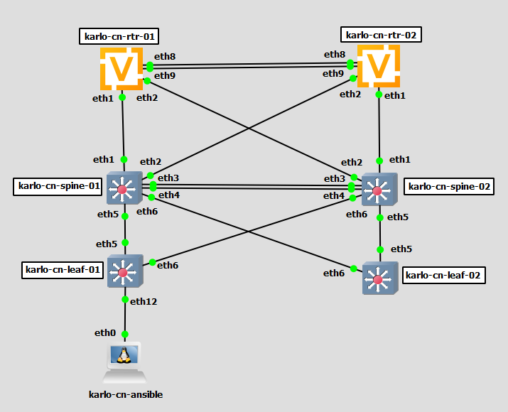

### Interface Mapping

| Device A Device | Device A Hostname | Device A port | Device B Device | Device B Hostname | Device B Port |
| --------------- | ----------------- | ------------- | --------------- | ----------------- | ------------- |
| vEOS Spine Switch 01 | karlo-cn-spine-01 | eth1 | VyOS Core router 01 | karlo-cn-rtr-01 | eth1 |
| vEOS Spine Switch 01 | karlo-cn-spine-01 | eth2 | VyOS Core router 02 | karlo-cn-rtr-02 | eth2 |
| vEOS Spine Switch 01 | karlo-cn-spine-01 | eth3 | vEOS Spine Switch 02 | karlo-cn-spine-02 | eth3 |
| vEOS Spine Switch 01 | karlo-cn-spine-01 | eth4 | vEOS Spine Switch 02 | karlo-cn-spine-02 | eth4 |
| vEOS Spine Switch 01 | karlo-cn-spine-01 | eth5 | vEOS Leaf Switch 01 | karlo-cn-leaf-01 | eth5 |
| vEOS Spine Switch 01 | karlo-cn-spine-01 | eth6 | vEOS Leaf Switch 02 | karlo-cn-leaf-02 | eth6 |
| vEOS Leaf Switch 01 | karlo-cn-leaf-01 | eth5 | vEOS Spine Switch 01 | karlo-cn-spine-01 | eth5 |
| vEOS Leaf Switch 01 | karlo-cn-leaf-01 | eth6 | vEOS Spine Switch 02 | karlo-cn-spine-02 | eth6 |
| vEOS Leaf Switch 01 | karlo-cn-leaf-01 | eth12 | Linux Ansible Host | karlo-cn-ansible | eth0 |

| Device A Device | Device A Hostname | Device A port | Device B Device | Device B Hostname | Device B Port |
| --------------- | ----------------- | ------------- | --------------- | ----------------- | ------------- |
| vEOS Spine Switch 02 | karlo-cn-spine-02 | eth1 | VyOS Core router 02 | karlo-cn-rtr-02 | eth1 |
| vEOS Spine Switch 02 | karlo-cn-spine-02 | eth2 | VyOS Core router 01 | karlo-cn-rtr-01 | eth2 |
| vEOS Spine Switch 02 | karlo-cn-spine-02 | eth3 | vEOS Spine Switch 01 | karlo-cn-spine-01 | eth3 |
| vEOS Spine Switch 02 | karlo-cn-spine-02 | eth4 | vEOS Spine Switch 01 | karlo-cn-spine-01 | eth4 |
| vEOS Spine Switch 02 | karlo-cn-spine-02 | eth5 | vEOS Leaf Switch 02 | karlo-cn-leaf-02 | eth5 |
| vEOS Spine Switch 02 | karlo-cn-spine-02 | eth6 | vEOS Leaf Switch 01 | karlo-cn-leaf-01 | eth6 |
| vEOS Leaf Switch 02 | karlo-cn-leaf-02 | eth5 | vEOS Spine Switch 02 | karlo-cn-spine-02 | eth5 |
| vEOS Leaf Switch 02 | karlo-cn-leaf-02 | eth6 | vEOS Spine Switch 01 | karlo-cn-spine-01 | eth6 |

## 3. Logical Topology

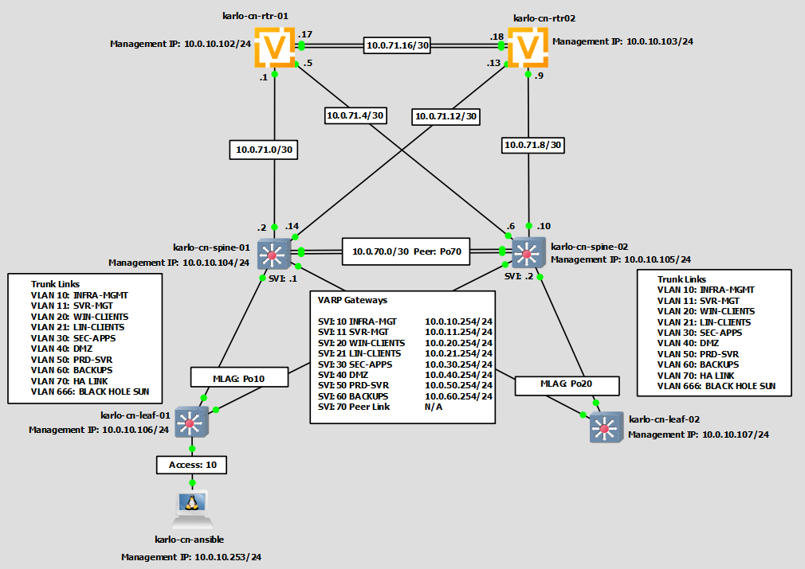

> [!NOTE]  
> In order to provision the devices using Ansible with only a bootstrap configuration, an out-of-band-management (OOBM) network was needed to replicate what would be done in a production environment with a separate OOBM network. This lab simulates this using a separate switch connected to the network devices via a dedicated VRF management network on vlan 10.  

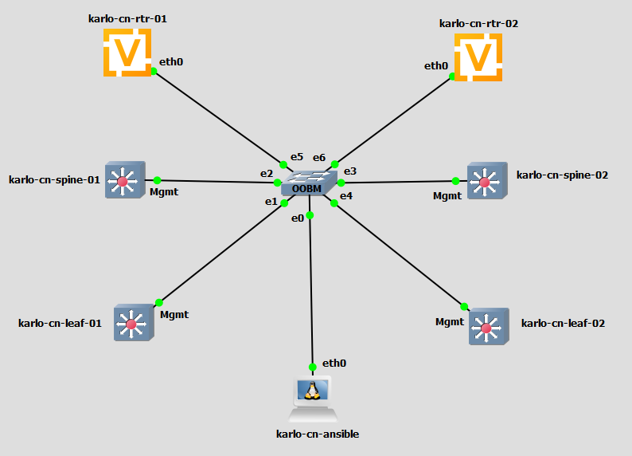

### IP Address Allocation (Spine Switch Layer-Arista vEOS)

| Hostname | GNS3 Port | Logical Interface | Allowed Vlan | Role | Link type |
| -------- | --------- | ----------------- | ------------ | ---- | --------- |
| karlo-cn-spine-01 | eth1 | Port-channel 1 | 10,11,20,21,30,40,50,60,666 | Uplink to Core Router 01 | Trunk |
| karlo-cn-spine-01 | eth2 | Port-channel 2 | 10,11,20,21,30,40,50,60,666 | Uplink to Core Router 02 | Trunk |
| karlo-cn-spine-01 | eth5 | Port-channel 10 | 10,11,20,21,30,40,50,60,666 | Downlink to Leaf Switch 01 | Trunk |
| karlo-cn-spine-01 | eth6 | Port-channel 20 | 10,11,20,21,30,40,50,60,666 | Downlink to Leaf Switch 02 | Trunk |
| karlo-cn-spine-01 | eth3 | Port-channel 70 | 10,11,20,21,30,40,50,60,666,700 | MLAG Primary peer link | Trunk |
| karlo-cn-spine-01 | eth4 | Port-channel 70 | 10,11,20,21,30,40,50,60,666,700 | MLAG Primary peer link | Trunk |
| karlo-cn-spine-02 | eth1 | Port-channel 2 | 10,11,20,21,30,40,50,60,666 | Uplink to Core Router 02 | Trunk |
| karlo-cn-spine-02 | eth2 | Port-channel 1 | 10,11,20,21,30,40,50,60,666 | Uplink to Core Router 01 | Trunk |
| karlo-cn-spine-02 | eth3 | Port-channel 70 | 10,11,20,21,30,40,50,60,666,700 | MLAG Secondary peer link | Trunk |
| karlo-cn-spine-02 | eth4 | Port-channel 70 | 10,11,20,21,30,40,50,60,666,700 | MLAG Secondary peer link | Trunk |
| karlo-cn-spine-02 | eth5 | Port-channel 20 | 10,11,20,21,30,40,50,60,666 | Downlink to Leaf Switch 02 | Trunk |
| karlo-cn-spine-02 | eth6 | Port-channel 10 | 10,11,20,21,30,40,50,60,666 | Downlink to Leaf Switch 01 | Trunk |

### IP Address Allocation (Access Switch Layer-Arista vEOS)

| Hostname | GNS3 Port | Logical Interface | Allowed Vlan | Role | Link type |
| -------- | --------- | ----------------- | ------------ | ---- | --------- |
| karlo-cn-leaf-01 | eth5 | Port-channel 10 | 10,11,20,21,30,40,50,60,666 | Uplink to Spine Switch 01 | Trunk |
| karlo-cn-leaf-01 | eth6 | Port-channel 10 | 10,11,20,21,30,40,50,60,666 | Uplink to Spine Switch 02 | Trunk |
| karlo-cn-leaf-01 | eth12 | - | 10 | Downlink to karlo-cn-ansible | Access |
| karlo-cn-leaf-02 | eth5 | Port-channel 20 | 10,11,20,21,30,40,50,60,666 | Uplink to Spine Switch 02 | Trunk |
| karlo-cn-leaf-02 | eth6 | Port-channel 20 | 10,11,20,21,30,40,50,60,666 | Uplink to Spine Switch 01 | Trunk |

## 4. High Availability & Routing Logic

  Design:
  This lab uses MLAG at layer 2 and VRRP at layer 3 in order to eliminate single points of failure. By using MLAG at Layer 2 and VRRP at Layer 3, the design achieves an active-active network state. This provides a resilient Virtual IP gateway for all end-host subnets, which allows for fail-over to the redundant links seamlessly.

  Link Aggregation:  
  Karlo-cn-spine-01/02 use a cross topology with eth1 and eth2 connecting to rtr-01/rtr-02 eth1 and eth 2 respectively. MLAG is configured on the spines and LACP is configured on the routers.  

## 5. Automation Workflow

Manual Bootstrap: Minimum configuration required via CLI to allow Ansible to reach the devices before pushing the remaining full configuration.  

> [!TIP]  
> For all switches, run `#zerotouch cancel` first to stop Arista ZTP and enter manual configuration mode. This will trigger an immediate switch reload.  

**karlo-cn-leaf-01 Bootstrap Config**  

```text
enable
config

! Management User
username leafadmin privilege 15 secret "{{ vault_leaf_admin_pass }}"
enable password "{{ vault_leaf_enable_pass }}"

! Enable eAPI
management api http-commands
   protocol https
   no protocol HTTP
   no shutdown
   vrf management
   no shutdown
   exit

! Create the management VRF
vrf instance management

! Configure the physical management port
interface Management1
   description OOBM-TO-ANSIBLE
   vrf management
   ip address 10.0.10.106/24
   no shutdown
exit

copy run start
```

**karlo-cn-leaf-02 Bootstrap Config**  

```text
enable
config

! Management User
username leafadmin privilege 15 secret "{{ vault_leaf_admin_pass }}"
enable password "{{ vault_leaf_enable_pass }}"

! Enable eAPI
management api http-commands
   protocol https
   no protocol HTTP
   no shutdown
   vrf management
   no shutdown
   exit

! Create the management VRF
vrf instance management

! Configure the physical management port
interface Management1
   description OOBM-TO-ANSIBLE
   vrf management
   ip address 10.0.10.107/24
   no shutdown
exit

copy run start

```text
**karlo-cn-spine-01 Bootstrap Config**  

```text
enable
config

! Management User
username spineadmin privilege 15 secret "{{ vault_spine_admin_pass }}"
enable password "{{ vault_spine_enable_pass }}"

! Enable eAPI
management api http-commands
   protocol https
   no protocol http
   no shutdown
   vrf management
   no shutdown
   exit

! Create the management VRF
vrf instance management

! Configure the physical management port
interface Management1
   description OOBM-TO-ANSIBLE
   vrf management
   ip address 10.0.10.104/24
   no shutdown
exit

copy run start

```text
**karlo-cn-spine-02 Bootstrap Config**  

```text
enable
config

! Management User
username spineadmin privilege 15 secret "{{ vault_spine_admin_pass }}"
enable password "{{ vault_spine_enable_pass }}"

! Enable eAPI
management api http-commands
   protocol https
   no protocol http
   no shutdown
   vrf management
   no shutdown
   exit

! Create the management isolation container
vrf instance management

! Configure the physical management port
interface Management1
   description OOBM-TO-ANSIBLE
   vrf management
   ip address 10.0.10.105/24
   no shutdown
exit

copy run start
```

### 6. Ansible Network Automation

  :white_check_mark: Basic configuration such as system hostname and compliance banners  
  :white_check_mark: Control plane hardening and RBAC  
  :white_check_mark: SNMP and Syslog configuration  
  :white_check_mark: NTP/DNS Settings  
  :white_check_mark: MLAG and LACP configuration  
  :white_check_mark: VLAN and Trunking configuration  
  :white_check_mark: MSTP configuration  

### 7. Security & Compliance Hardening

**Banner/MOTD:**  
Mandatory legal warning for unauthorized access.

**Management ACLs:**  
Restrict SSH and SNMP traffic so that only the Ansible node's IP can connect. The end goal is to simulate a dedicated windows machine to simulate an authorized Administrator/Engineer's workstation being the only device able to manage into the routers.

**SSH Hardening:**  

**Administrative Security:**  
✅ Individual Accounts: Linux Sudo Groups

**External Authentication:**  
An authentication order will be configured via Pluggable Authentication Modules:  
✅ RADIUS as primary (running on the Domain Controllers)  
✅ local as fallback.  

**Logging & Accountability**  
✅ NTP  
✅ Syslog configuration  
✅ SNMPv3 only

### 8. Verification

## Ansible 'Deploy North Star' Playbook for Phase 2  

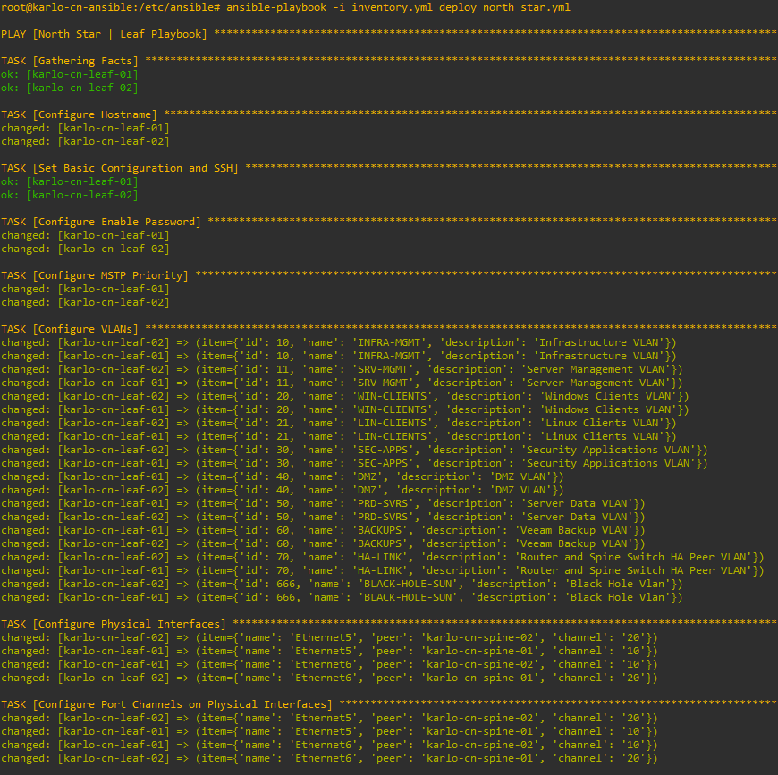
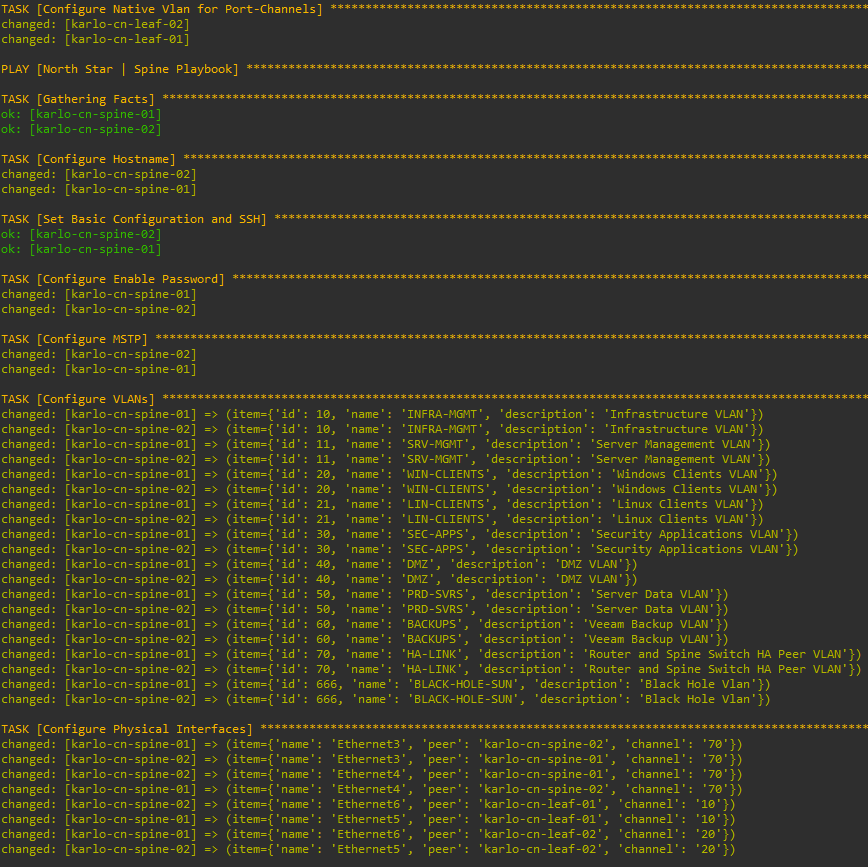
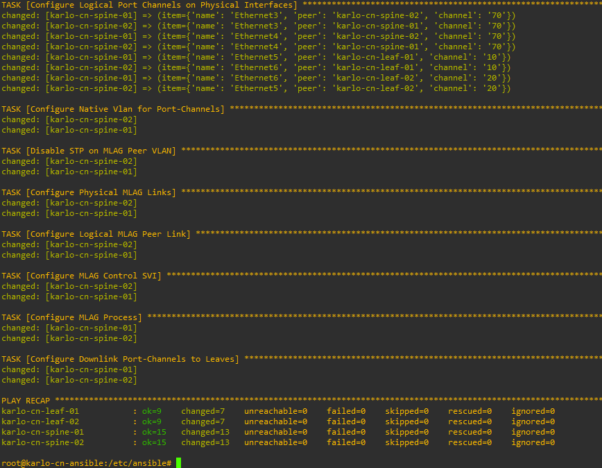

## MLAG between Spine-01 and Spine-02  
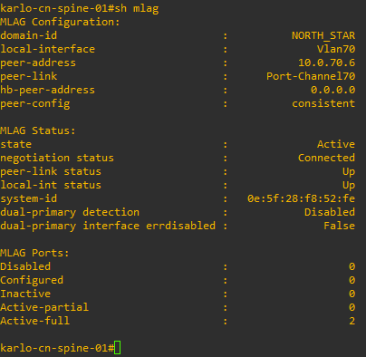 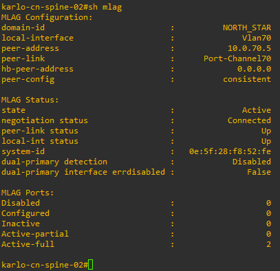

## Leaf LACP Peer  

**Leaf 1**  

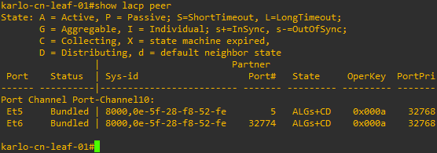

**Leaf 2**  

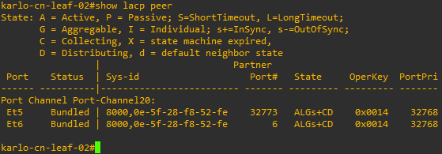

> [!NOTE]  
> By subtracting 32768 from the number found in the Port# column, we can verify the correct secondary port is in use

## Spanning Tree  

**Leaf 1**  
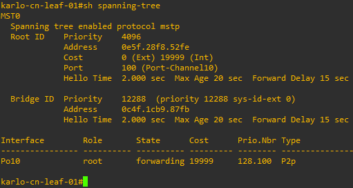 

**Leaf 2**  
 

**Spine 1**  
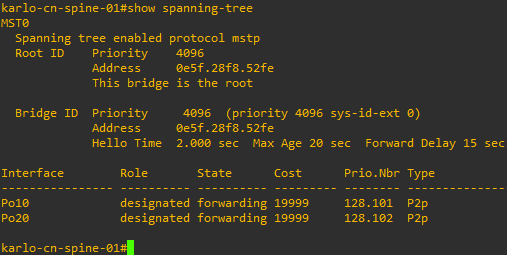 

**Spine 2**  

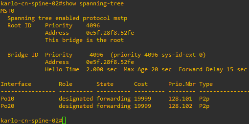